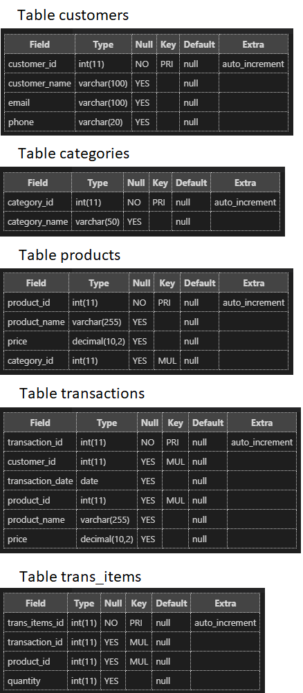
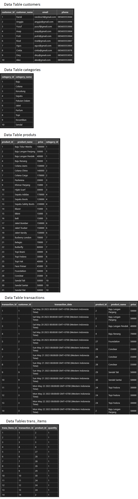
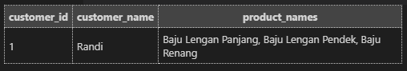
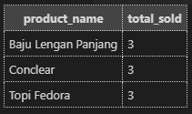
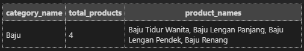
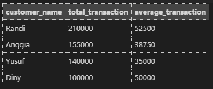
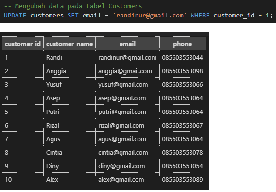

# Technical Project Assignment (TPA) #4 Online Retail Database Design

## Tables:

## Insert Data Tables:

## Mengambil data pelanggan yang membeli 3 barang yang berbeda:

## Melihat 3 produk yang paling sering dibeli oleh pelanggan:

## Melihat kategori barang yang paling banyak barangnya:

## Nominal rata-rata transaksi yang dilakukan oleh pelanggan dalam 1 bulan terakhir:

## Mengubah data pada tabel Customers:

